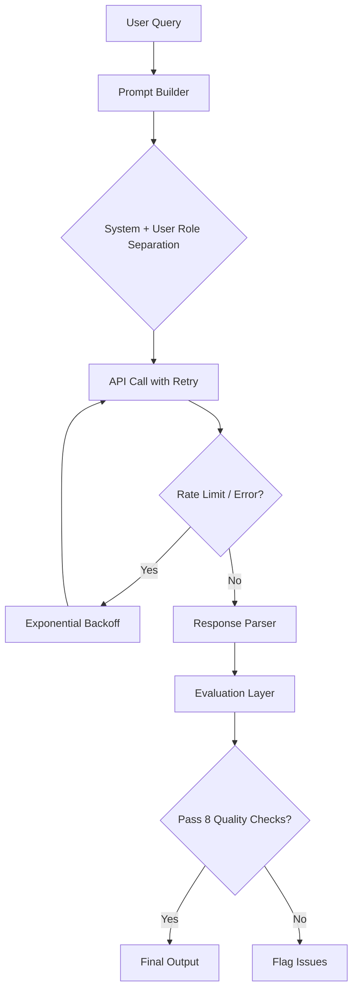

# AI Support Copilot

A production-style AI support assistant designed to demonstrate how developers can build, evaluate, and improve real-world AI-powered features using modern API workflows.

## What this project demonstrates

Most AI projects stop at the API call: send a question, get a response, show it to the user. This project goes further by implementing the infrastructure that production systems actually need:

- **Structured prompts** with proper system and user role separation
- **Retry logic** with exponential backoff for rate limits and server errors
- **Response evaluation** across 8 quality dimensions before output reaches a user
- **Failure mode documentation** covering real issues developers encounter in production

## Who this is for

- Developers building AI-powered features for the first time
- Engineers who want to move beyond "call the API" to production-quality systems
- Technical writers and DevRel professionals exploring AI documentation
- Anyone interested in improving AI reliability and usability in products

## Architecture overview

## Quick links

| What you want to do | Where to go |
|---|---|
| Get started quickly | [Quickstart](/docs/quickstart) |
| Understand prompt design | [Prompt Design](/docs/concepts/prompts) |
| Learn about response evaluation | [Evaluation System](/docs/concepts/evaluation) |
| Build a complete chatbot | [Build a Chatbot](/docs/guides/build-chatbot) |
| Debug common issues | [Troubleshooting](/docs/troubleshooting/api-errors) |
| See all evaluation checks | [Evaluation Reference](/docs/reference/evaluation-checks) |

## Source code

The source code for this project lives at [github.com/Someshchawan/ai-support-copilot](https://github.com/Someshchawan/ai-support-copilot). This documentation site is a separate repository focused on the developer learning experience.
